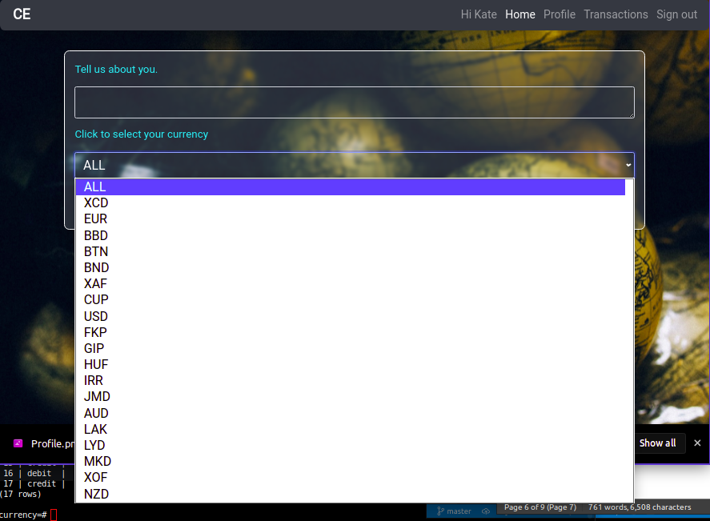

### Project Name: CURRENCY EXCHANGE APPLICATION

### Project Description
A Python-Flask Application that implements a currency exchange function using a currency conversion API that updates regularly. 

Watch Live Demo:
[![Watch the video]](https://youtu.be/pzUS_yKeVxI)

### Setup Instructions

#### Preparation
mkdir currency-exchange
	Git
		git init
		touch .gitignore
#### Installations
pip install virtualenv
Create Virtual Environment called ‘virtual’: virtualenv virtual
Activate Virtual Environment: source virtual/bin/activate  
* Install Flask: pip install flask
* Install Requests: pip install requests
* Bootstrap: pip install flask-bootstrap
* Forms: pip install flask-wtf
* Flash Script: pip install flash-script
* Fonts: pip install Flask-FontAwesome
* LogIn: pip install flask-login
* Werkzeug: pip install -U Werkzeug==0.16.0
* Database Installations: 
   * pip install flask-SQLAlchemy
   * pip install psycopg2
* Database Migrations: 
   * pip install Flask-Migrate==2.7.0
	* python3 manage.py db init
	* python3 manage.py db migrate -m "Initial Migration"
	* python3 manage.py db upgrade
* Enable easy run: 	
   * chmod a+x start.sh
	* ./start.sh

* This website requires that you have data access to internet data.

### BDD
#### API
The API chosen for this project is the Free Currency Converter. The API provider offers free web services for developers to convert one currency to another. Currency values are updated every 60 minutes but on the free plan may experience some downtime occasionally. 
#### User Authentication
Authentication comprises a log-in, signup, profile and edit profile function that includes the option to update a profile picture and select a default currency. Every user starts with a KES 1000 balance converted into their default currency.

#### Currency COnversion
A user can convert from one currency to the other on request using the “Make Conversion” function. Another way conversion happens is through transactions. For instance, when one user sends money to another user in the same app, in the case that their default currencies are different, conversion happens by default and reaches the receiver wallet in their default currency. The conversions are up to date with the conversion rates which update every hour. Debit and Credit functions can also be performed in any currency by a user to their own wallets and the money is saved to their wallets in their individual currencies. 
#### Transactions
Transactions are displayed on the transactions page depending on the user where they can view debits and credits that occurred in their accounts as statement of accounts. Time and amount are also included in the report. 

#### Database Tables

                           List of relations
              Schema |      Name       | Type  |   Owner   
            --------+-----------------+-------+-----------
            public | alembic_version | table | deepeters
            public | transactions    | table | deepeters
            public | users           | table | deepeters
            public | wallets         | table | deepeters
            (4 rows)

#### Deployment

Deployment
Deployment has been achieved through Heroku. Heroku is a cloud deployment platform that is able to implement both the application dependencies and the database.
1. pip install gunicorn
2. pip freeze > requirements.txt
3. touch Procfile and write the code: 
   * web: gunicorn manage:app into the file.
4. heroku login
5. heroku create currency-exchange-application
6. heroku config:set API_KEY=<'YOUR MOVIE API'>
7. heroku config:set SECRET_KEY=<'YOUR SECRET KEY'>
8. heroku addons:create heroku-postgresql
9. Alter config.py with:
	* class ProdConfig(Config):
    	SQLALCHEMY_DATABASE_URI = os.environ.get("DATABASE_URL")
10. Alter manage.py
	* From: app = create_app(‘development’)
	* To: app = create_app(‘production’)
11. pip freeze > requirements.txt
12. Push to App Heroku
	* git push heroku master
13. Deploy Database
	* heroku run python3 manage.py db upgrade

#### Future Development
As the business grows, the number of requests is expected to increase on the server. To handle an increased number of requests, the application would need to use another API as the one applied here has a limit on the number of responses and requests it can provide and receive per unit time. The future applied API also needs to update the exchange rates instantly as in the exchange market rather than the 60 minute rate provided in this application.

### Author: [DENNIS NJENGA](https://github.com/deepeters)
### Contact Infomation:

         Email: dennis95peters@gmail.com
         Phone: +254 715 144831

### Technology Used
1. HTML5
2. CSS3
3. Python3
4. PostgreSQL

### Frameworks Used
1. Git
2. Bootstrap
3. Flask
4. Heroku

### LICENSE: [MIT LICENSE](https://raw.githubusercontent.com/deepeters/currency-exchange-app/master/LICENSE)